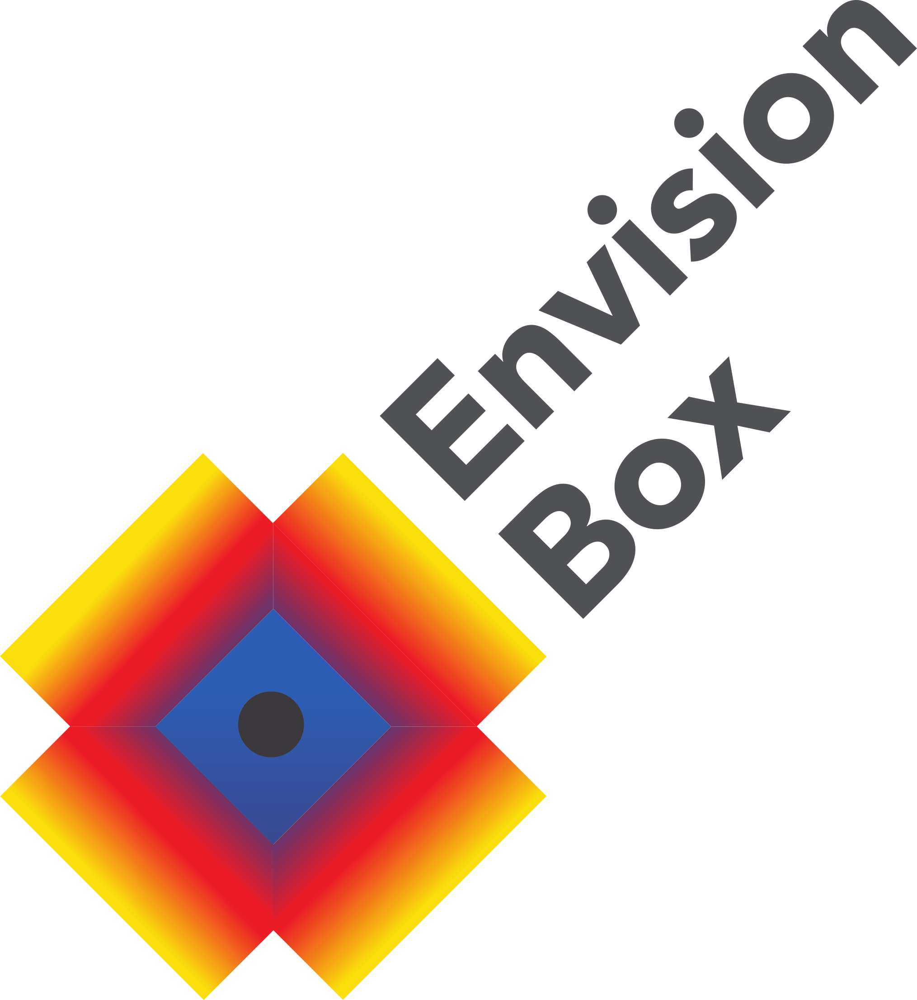
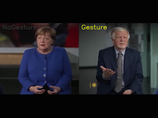

```{=html}
<div class="video-widget">
<video controls width="100%" style="display:block; height:auto;">
  <source src="https://envisionbox.org/videotutorials/tutorial_usingenvisionhgdetector_19022026.mp4" type="video/mp4">
  Your browser does not support the video tag.
</video>
</div>
```

{fig-align="center" width=150}

# Info
In the following notebook, we are going to use an envisionbox python package. This package is called "envisionhgdetector" and contains functions to automatically annotate gesture, to perform kinematic analysis, and to produce a visualization dashboard. In some other envisionbox module on training a gesture classifier we exhibited an end-to-end pipeline for training a model on particular human behaviors, e.g., head nodding, clapping; and then producing some inferences on new videos. We also already presented how to do DTW analyses for exploring gesture similarity embedding spaces embedding spaces, and we have an introduced dashboards for visualizing gestures alongside static data. This package builds on this work.

::: {.callout-tip}
## Version 3.0
This tutorial covers **envisionhgdetector version 3.0**, featuring a new combined CNN + LightGBM gesture detection routine.
:::

# Overview

::: {layout="[[1,1]]" layout-valign="center"}
{width=300}

{width=300}
:::

**EnvisionHGDetector** is a Python package for automatic hand gesture detection, kinematic analysis, and visualization. The package provides an end-to-end pipeline from raw video to quantitative gesture metrics and interactive dashboards.

## Key Features Discussed Here

| Feature | Description |
|---------|-------------|
| **Gesture Detection** | CNN + LightGBM for flexible gesture classification |
| **ELAN Export** | Generate annotation files compatible with ELAN |
| **Kinematic Analysis** | Extract velocity, acceleration, jerk, and trajectory features |
| **DTW Similarity** | Dynamic Time Warping for gesture comparison and clustering |
| **Interactive Dashboard** | Visualize gestures with embedded video playback |

## What's New in Version 3.0
- **Two Model Architectures**: CNN and LightGBM predictions
- **New training data**: ECOLANG, ZHUBO, SAGA, SAGA++, ECOLANG, and now also GESRES (See below for citations)
- **Feature Extraction Updates**: Models now use visibility and world landmarks

::: {.callout-note .callout-installation collapse="true"}
## 🛠️ Installation Guide

### Prerequisites

- **Anaconda** (recommended, NOT Miniconda) [see getting started](https://envisionbox.org/gettingstarted.html)
- Python 3.10
- C++ redistributables (Windows only)

::: {.panel-tabset}

### Windows

**Step 1: Create Conda Environment**

```bash
conda create -n envision python=3.10
conda activate envision
```

**Step 2: Install Dependencies (optional)**
Install any dependencies for your notebook.

```bash
(envision) pip install -r requirements.txt
```

**Step 3: Install Package**
Base installation of the envisionhgdetector from PyPi. If that is already in your notebook requirements.txt you dont have to to do this again.
```bash
(envision) pip install envisionhgdetector
```

::: {.callout-warning}
**Windows Users**: If you encounter TensorFlow errors, install the [Microsoft Visual C++ Redistributable](https://learn.microsoft.com/en-us/cpp/windows/latest-supported-vc-redist).
:::

### macOS
We would like to thank Fabian Eckert (`fabian.eckert@uni-koeln.de`) for helping out in testing the OS installation procedure. Please reach out to us if there are improvements here by emailing Wim Pouw (`w.pouw@tilburguniversity.edu`) and Fabian Eckert (who can test improvements on OS).

macOS requires a specific installation order due to MediaPipe compatibility:

**Step 1: Create Conda Environment**

```bash
conda create -n envision python=3.10
conda activate envision
(envision) conda install pip
```

**Step 2: Install Dependencies**

Download `requirements_macos.txt` from the repository, then:

```bash
(envision) cd /path/to/requirements_macos.txt
(envision) pip install -r requirements_macos.txt
```

**Step 3: Install Package (without dependencies)**

```bash
(envision) pip install envisionhgdetector --no-deps
```

**Step 4: Install LightGBM via Conda**

```bash
(envision) conda install -c conda-forge lightgbm
```

**Step 5: Force Reinstall Compatible Versions**

```bash
(envision) conda install --force-reinstall numpy==1.26.4 pandas
```

### Linux

Follow the Windows instructions. If you encounter issues with MediaPipe, try the macOS approach.

:::

### Verify Installation

```python
from envisionhgdetector import GestureDetector
print("Installation successful!")
```

:::

---

# Pipeline

The EnvisionHGDetector pipeline consists of five main stages:

```{mermaid}
flowchart LR
    A[ Video Input] --> B[ Pose Tracking and Gesture Detection]
    B --> C[ Kinematic Analysis]
    C --> D[ Visualization]
    
    style A fill:#e1f5fe
    style B fill:#fff3e0
    style C fill:#f3e5f5
    style D fill:#e8f5e9
```

## Stage 1: Pose Tracking (MediaPipe)

The package uses **MediaPipe Holistic** to extract:

- **33 Body Landmarks**: Full body pose estimation
- **21 Hand Landmarks** (per hand): Detailed finger tracking
- **World Coordinates**: 3D positions in meters (hip-centered)

::: {.callout-note collapse="true"}
## MediaPipe Configuration Details in EnvisionHGdetector

```python
# Internal MediaPipe settings
mp_holistic = mp.solutions.holistic
holistic = mp_holistic.Holistic(
    static_image_mode=False,
    model_complexity=1,
    smooth_landmarks=True,
    enable_segmentation=False,
    min_detection_confidence=0.5,
    min_tracking_confidence=0.5
)
```

The world landmarks provide metric coordinates where:
- Origin is at the hip center
- Units are in meters
- Z-axis points toward the camera
:::

## Stage 2: Gesture Detection (CNN + LightGBM)

Version 3.0 uses a **combined model architecture** with two complementary classifiers:

### CNN Model (Convolutional Neural Network)

- **Input**: 25 frames (1 second at 25 FPS)
- **Architecture**: Residual blocks with skip connections
- **Output**: 3-class (None, Move, Gesture)
- **Advantage**: Better at filtering self-adaptors

### LightGBM Model (Gradient Boosting)

- **Input**: 5 frames (0.2 seconds)
- **Features**: 92 engineered features per window
- **Output**: 2-class (No Gesture, Gesture)
- **Advantage**: Fast and simple


::: {.callout-note collapse="true"}
## Feature Details LightGBM

The LightGBM model uses **100 features** extracted from 5-frame windows of world landmarks:

| Feature Group | Count | Description |
|---------------|-------|-------------|
| Current pose | 18 | Key joint positions (shoulders, elbows, wrists) |
| Velocity | 18 | Frame-to-frame joint velocities |
| Wrist speeds | 2 | Left/right wrist speed magnitude |
| Wrist ranges | 6 | Position range over window |
| Finger positions | 18 | Pinky, index, thumb relative to wrist |
| Finger distances | 6 | Inter-finger distances per hand |
| Wrist acceleration | 2 | Left/right acceleration |
| Trajectory smoothness | 2 | Velocity variation per wrist |
| Wrist height | 2 | Height relative to shoulders |
| Wrist spread | 1 | Distance between wrists |
| Arm extension | 2 | Shoulder-to-wrist distances |
| Total motion | 1 | Summed wrist displacement |
| Symmetry features | 2 | Position & motion symmetry |
| Visibility scores | 20 | Current, mean, and min visibility |
| **Total** | **100** | |
:::

## Stage 3: Kinematic Analysis

For each detected gesture segment, the package computes comprehensive kinematic features:

::: {.panel-tabset}
### Spatial Features

- **Space use**: Gesture space utilization
- **McNeillian zones**: Maximum and modal gesture space
- **Volume**: 3D gesture volume
- **Max height**: Maximum vertical amplitude

### Temporal Features

- **Duration**: Total gesture time
- **Hold count**: Number of pauses
- **Hold time**: Total time in holds
- **Hold avg duration**: Mean pause length

### Dynamic Features

- **Peak/mean speed**: Hand and elbow velocities
- **Peak acceleration**: Maximum acceleration
- **Peak deceleration**: Maximum deceleration
- **Peak jerk**: Maximum jerk (smoothness)

### Submovement Features

- **Submovement count**: Number of velocity peaks
- **Submovement peaks**: Peak velocities
- **Mean amplitude**: Average submovement size

### DTW Analysis

- Gesture similarity matrix
- Cluster assignments
- Representative gestures

The DTW calculation is a classic dependent multivariate DTW with no warping constraints based on the upper limb keypoints. At some point we want to change this to more state-of-the-art variants of DTW.
:::

## Stage 4: Visualization Dashboard

The interactive Dash-based dashboard provides:

- Gesture video playback (side-by-side comparison)
- Kinematic feature plots
- DTW similarity heatmaps
- Exportable statistics

---

# Quick Start Tutorial

## Setup

```{python}
#| eval: false
#| code-fold: false

import os
import glob
from IPython.display import Video

# Define folders
videofoldertoday = './videos_to_label/'
outputfolder = './output/'

# Create output directory
os.makedirs(outputfolder, exist_ok=True)

# List available videos
videos = glob.glob(videofoldertoday + '*.mp4')
print(f"Found {len(videos)} videos to process")

# Preview a video (in Jupyter)
Video(videos[0], embed=True, width=400)
```

## Step 1: Detect Gestures

::: {.callout-tip}
## Model Types
- `"combined"` - Uses both CNN and LightGBM (recommended)
- `"cnn"` - CNN only (3-class: None, Move, Gesture)
- `"lightgbm"` - LightGBM only (faster, 2-class)
:::

```{python}
#| eval: false
#| code-fold: false

from envisionhgdetector import GestureDetector
import os

# Absolute paths (recommended)
videofoldertoday = os.path.abspath('./videos_to_label/')
outputfolder = os.path.abspath('./output/')

# Create detector with combined model
detector = GestureDetector(
    model_type="combined",
    cnn_motion_threshold=0.5,    # Motion gate sensitivity
    cnn_gesture_threshold=0.5,   # CNN gesture confidence
    lgbm_threshold=0.5,          # LightGBM gesture probability
    min_gap_s=0.1,               # Merge gaps smaller than this
    min_length_s=0.1             # Minimum gesture duration
)

# Process all videos in folder
print("Step 1: Processing videos...")
detector.process_folder(
    input_folder=videofoldertoday,
    output_folder=outputfolder,
)
```

::: {.callout-note collapse="true"}
## Output Files Generated

After processing, check your output folder:

```{python}
#| eval: false

import glob
import os

# List all output files
outputfiles = glob.glob(outputfolder + '/*')
for file in outputfiles:
    print(os.path.basename(file))
```

Files created per video:
- `video_name_predictions.csv` - Frame-by-frame predictions
- `video_name_segments.csv` - Gesture segment list  
- `video_name_labeled.mp4` - Annotated video
- `video_name.eaf` - ELAN annotation file
:::

## Step 2: View Results

```{python}
#| eval: false
#| code-fold: false

import pandas as pd
from moviepy import VideoFileClip
from IPython.display import Video

# Load segment data
csvfiles_segments = glob.glob(outputfolder + '/*segments.csv')
df = pd.read_csv(csvfiles_segments[0])
print(df.head())

# View labeled video (may need re-rendering for Jupyter)
videoslabeled = glob.glob(outputfolder + '/*.mp4')

# Re-render for Jupyter display
clip = VideoFileClip(videoslabeled[0])
clip.write_videofile("./temp/example_labeled.mp4")
Video("./temp/example_labeled.mp4", embed=True, width=500)
```

## Step 3: Cut Video Segments

Extract individual gesture clips from the full video:

```{python}
#| eval: false
#| code-fold: false

from envisionhgdetector import utils

print("Step 2: Cutting segments...")
segments = utils.cut_video_by_segments(outputfolder)

# Check the gesture segments folder
gesture_segments_folder = os.path.join(outputfolder, "gesture_segments")
if os.path.exists(gesture_segments_folder):
    segment_files = [f for f in os.listdir(gesture_segments_folder) if f.endswith('.mp4')]
    print(f"Found {len(segment_files)} gesture segment files")
```

## Step 4: Retrack with World Landmarks

Retrack gestures using metric 3D coordinates (meters) for kinematic analysis:

```{python}
#| eval: false
#| code-fold: false

# Create paths for analysis
gesture_segments_folder = os.path.join(outputfolder, "gesture_segments")
retracked_folder = os.path.join(outputfolder, "retracked")
analysis_folder = os.path.join(outputfolder, "analysis")

print("Step 4: Retracking gestures with world landmarks...")
tracking_results = detector.retrack_gestures(
    input_folder=gesture_segments_folder,
    output_folder=retracked_folder
)
print(f"Tracking results: {tracking_results}")
```

## Step 5: DTW Analysis & Kinematics

Compute Dynamic Time Warping distances and extract kinematic features:

```{python}
#| eval: false
#| code-fold: false

if "error" not in tracking_results:
    print("Step 5: Computing DTW and kinematics...")
    analysis_results = detector.analyze_dtw_kinematics(
        landmarks_folder=tracking_results["landmarks_folder"],
        output_folder=analysis_folder
    )
    print(f"Analysis results: {analysis_results}")
```

::: {.callout-note collapse="true"}
## Kinematic Features Extracted

The kinematic analysis extracts comprehensive features for the most active hand in each gesture:

::: {.panel-tabset}

### Spatial Features

| Feature | Description |
|---------|-------------|
| `space_use` | Gesture space utilization score |
| `mcneillian_max` | Maximum McNeillian space value |
| `mcneillian_mode` | Most frequent McNeillian space zone |
| `volume` | 3D gesture volume |
| `max_height` | Maximum vertical height reached |

### Temporal Features

| Feature | Description | Unit |
|---------|-------------|------|
| `duration` | Gesture duration | seconds |
| `hold_count` | Number of holds (pauses) | count |
| `hold_time` | Total time in holds | seconds |
| `hold_avg_duration` | Average hold duration | seconds |

### Dynamic Features (Hand)

| Feature | Description | Unit |
|---------|-------------|------|
| `hand_peak_speed` | Maximum hand velocity | m/s |
| `hand_mean_speed` | Average hand velocity | m/s |
| `hand_peak_acceleration` | Maximum acceleration | m/s² |
| `hand_peak_deceleration` | Maximum deceleration | m/s² |
| `hand_peak_jerk` | Maximum jerk | m/s³ |

### Dynamic Features (Elbow)

| Feature | Description | Unit |
|---------|-------------|------|
| `elbow_peak_speed` | Maximum elbow velocity | m/s |
| `elbow_mean_speed` | Average elbow velocity | m/s |
| `elbow_peak_acceleration` | Maximum elbow acceleration | m/s² |
| `elbow_peak_deceleration` | Maximum elbow deceleration | m/s² |
| `elbow_peak_jerk` | Maximum elbow jerk | m/s³ |

### Submovement Features

| Feature | Description |
|---------|-------------|
| `hand_submovements` | Number of hand submovements |
| `hand_submovement_peaks` | Peak velocities of submovements |
| `hand_mean_submovement_amplitude` | Mean submovement amplitude |
| `elbow_submovements` | Number of elbow submovements |
| `elbow_mean_submovement_amplitude` | Mean elbow submovement amplitude |

:::

```{python}
#| eval: false

# Load kinematic features
import pandas as pd
kinematic_file = os.path.join(analysis_folder, "kinematic_features.csv")
df_kin = pd.read_csv(kinematic_file)
print(f"Extracted features for {len(df_kin)} gestures")
df_kin.head()
```
:::

## Step 6: Launch Dashboard

Create and run the interactive visualization dashboard:

```{python}
#| eval: false
#| code-fold: false

if "error" not in analysis_results:
    print("Step 6: Preparing dashboard...")
    detector.prepare_gesture_dashboard(
        data_folder=analysis_folder
    )
```

Such a dashboard can be hosted on a server for example, like here: .

::: {.callout-note collapse="true"}
## Running the Dashboard

After preparation, launch the dashboard from your terminal:

```bash
conda activate envision
cd output/
python app.py
```

Then open your browser to the displayed address (typically `http://127.0.0.1:8050`).

{width=400}
:::

---

# Citation

If you use this package, please use this latest citation (we are working on an update for 3.0):

> Pouw, W., Shaikh, S., Trujillo, J., Yung, B., Rueda-Toicen, A., de Melo, G., & Owoyele, B. (2026). EnvisionHGdetector: A Computational Framework for Co-speech Gesture Detection, Kinematic Analysis, and Interactive Visualization (Version 3.0.1). https://pypi.org/project/envisionhgdetector/

The paper describing the package is currently in press, to be included into a diamond open access book, and can be cited as:

Pouw, W., Ahmed-Shaikh, S., Trujillo, J., Yung, B., Rueda-Toicen, A., de Melo, G., & Owoyele, B. (2026). EnvisionHGdetector: A Computational Framework for Co-speech Gesture Detection, Kinematic Analysis, and Interactive Visualization. In A. Lücking & A. Mehler (Eds.), Bahavioromics: Semantic, experimental, and computational multimodal interaction studies. Logod Verlag, Berlin. [Link to postprint](https://www.wimpouw.com/files/gh_detectorPREPRINT.pdf)

::: {.callout-note collapse="true"}
## Additional Citations

**Original Training Framework:**

- Yung, B. (2022). Nodding Pigeon (Version 0.6.0) [Computer software]. https://github.com/bhky/nodding-pigeon

**Training Datasets:**

- Lücking, A., Bergmann, K., Hahn, F., Kopp, S., & Rieser, H. (2010). The Bielefeld speech and gesture alignment corpus (SaGA). In LREC 2010 workshop: Multimodal corpora–advances in capturing, coding and analyzing multimodality.
- Gu, Y., Donnellan, E., Grzyb, B., Brekelmans, G., Murgiano, M., Brieke, R., ... & Vigliocco, G. (2025). The ECOLANG Multimodal Corpus of adult-child and adult-adult Language. Scientific Data, 12(1), 89.
- Koutsombogera, M., & Vogel, C. (2017, November). The MULTISIMO multimodal corpus of collaborative interactions. In Proceedings of the 19th ACM International Conference on Multimodal Interaction (pp. 502-503).
- Bao, Y., Weng, D., & Gao, N. (2024). Editable Co-Speech Gesture Synthesis Enhanced with Individual Representative Gestures. Electronics, 13(16), 3315.
- Rohrer, P. (2022). A temporal and pragmatic analysis of gesture-speech association: A corpus-based approach using the novel MultiModal MultiDimensional (M3D) labeling system (Doctoral dissertation, Nantes Université; Universitat Pompeu Fabra (Barcelone, Espagne)).
- Hensel, L. B., Cheng, S., & Marsella, S. (2025). A richly annotated dataset of co-speech hand gestures across diverse speaker contexts. Scientific Data, 12(1), 1748.

**Methods:**

- Lugaresi, C., Tang, J., Nash, H., McClanahan, C., Uboweja, E., Hays, M., ... & Grundmann, M. (2019). Mediapipe: A framework for building perception pipelines. arXiv preprint arXiv:1906.08172.
- Trujillo, J. P., Vaitonyte, J., Simanova, I., & Özyürek, A. (2019). Toward the markerless and automatic analysis of kinematic features: A toolkit for gesture and movement research. Behavior research methods, 51(2), 769-777.
- Pouw, W., & Dixon, J. A. (2020). Gesture networks: Introducing dynamic time warping and network analysis for the kinematic study of gesture ensembles. Discourse Processes, 57(4), 301-319.
:::

---

# Resources
- **Package**: [PyPI - envisionhgdetector](https://pypi.org/project/envisionhgdetector/)
- **Source Code**: [GitHub Repository](https://github.com/WimPouw/envisionBOX_modulesWP)
- **Documentation**: [EnvisionBox](https://envisionbox.org/)
- **Paper**: [EnvisionHGDetector Postprint](https://www.wimpouw.com/files/gh_detectorPREPRINT.pdf)

::: {.callout-note}
## Feedback & Contributions
We welcome bug reports, feature requests, and contributions! Please open an issue on GitHub or contact us directly.
:::
