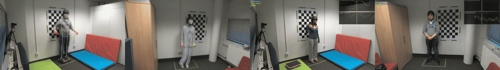

{fig-align="center" width=100%}

Every channel is keyed by **pair** (`103_203`) and **trial** (`12`). Set `CORPUS` once.

# Setup

::: {.panel-tabset}

## Python

```{python}
import os, re, glob
import numpy as np
import pandas as pd
import matplotlib.pyplot as plt

CORPUS    = "../.."
meta_path = f"{CORPUS}/metadata.csv"
demo_path = f"{CORPUS}/demographics.csv"
gyro_path = f"{CORPUS}/gyroscope.csv"
acoustics = f"{CORPUS}/TS_acoustics"
gestures  = f"{CORPUS}/gestureclassifications"
videos    = f"{CORPUS}/videos"
audios    = f"{CORPUS}/audios"

```

## R

```{r}
#| message: false
library(tidyverse)

CORPUS    <- "../.."
meta_path <- file.path(CORPUS, "metadata.csv")
demo_path <- file.path(CORPUS, "demographics.csv")
gyro_path <- file.path(CORPUS, "gyroscope.csv")
acoustics <- file.path(CORPUS, "TS_acoustics")
gestures  <- file.path(CORPUS, "gestureclassifications")
videos    <- file.path(CORPUS, "videos")
audios    <- file.path(CORPUS, "audios")
```

:::
