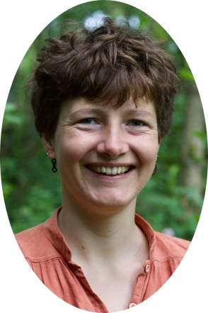
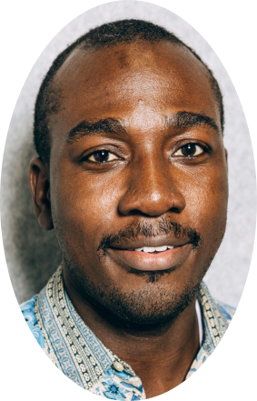
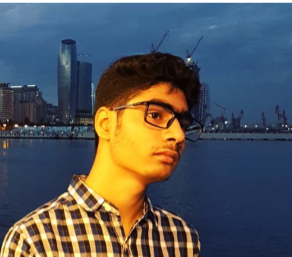
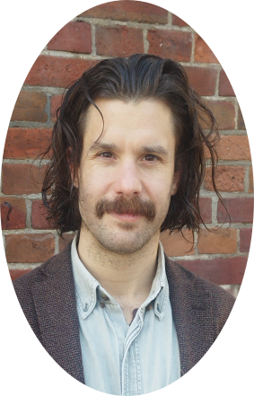

::: {.grid}

::: {.g-col-2}
{fig-align="left"}
:::
::: {.g-col-4}
**Andrea González Sánchez**  
Topics: multimodal communication, group coordination dynamics, music, aesthetic experiences, Python
:::

::: {.g-col-2}
{fig-align="left"}
:::
::: {.g-col-4}
**Anna Palmann** 
Topics: multimodal communication, hearing impairments, accessibility and inclusion, dyadic interaction
:::

::: {.g-col-2}
{fig-align="left"}
:::
::: {.g-col-4}
**Babajide Owoyele** 
Topics: design science, socio-semantic analysis, natural language processing, data archiving, multimodal analytics interfaces
:::

::: {.g-col-2}
{fig-align="left"}
:::
::: {.g-col-4}
**Davide Ahmar** 
Topics: social neurocognition, hyperscanning, multimodal recordings, virtual reality, cognitive neuroscience.
:::

::: {.g-col-2}
{fig-align="left"}
:::
::: {.g-col-4}
**James Trujillo** 
Topics: multimodal communication, neurodiversity, virtual/artificial agents, embodied cognitive science, python, open science
:::

::: {.g-col-2}
{fig-align="left"}
:::
::: {.g-col-4}
**Marijn Hafkamp** 
Topics: motor learning, interpersonal coordination, joint action, ecological psychology, complex/dynamical systems theory, motion capture
:::

::: {.g-col-2}
{fig-align="left"}
:::
::: {.g-col-4}
**Sharjeel Ahmed Shaikh** 
Topics: pose estimation, gesture detection (envisionhgdetector), privacy-enabled data sharing
:::

::: {.g-col-2}
{fig-align="left"}
:::
::: {.g-col-4}
**Šárka Kadavá** 
Topics: multimodal communication, multimodal data collection, pose estimation, physical effort, signal processing, Python, reproducibility
:::

::: {.g-col-2}
{fig-align="left"}
:::
::: {.g-col-4}
**Tifanny Matej Hrkalović** 
Topics: social signal processing, human-AI interaction, social cognition, Python, person perceptions
:::

::: {.g-col-2}
{fig-align="left"}
:::
::: {.g-col-4}
**Travis Wiltshire** 
Topics: complex systems theory and methods, collective cognition, coordination dynamics, synchrony, R, open science
:::

::: {.g-col-2}
{fig-align="left"}
:::
::: {.g-col-4}
**Wim Pouw** 
Topics: multimodal coordination, movement science, (radical) embodied cognitive science, R, Python, open science, EnvisionBox
:::

:::

