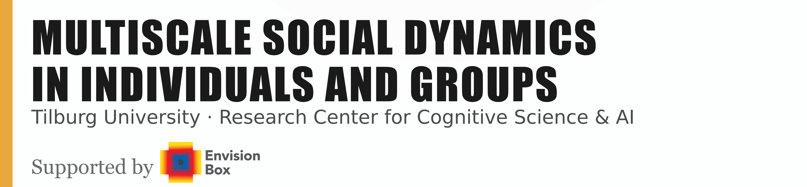

{fig-align="center" width=100%}

## Overview

Dear participants,

this handbook collects all scripts associated with the program of MDIG2026 Summer School. 
You will find here introduction of the datasets you will be working in your group projects, scripts that process
these datasets into analyzable time series and features and finally, all scripts associated with the lectures.

The two datasets that we picked for this year are:

- **Balance Corpus** (Li, Yang, Fuchs & Aussems, 2026)

```{=html}

```

[📄 Download the paper (PDF)](Datasets/BalanceCorpus/documentation/LiYangFuchsAussems2026.pdf){target="_blank"}

- **PARSEL dataset** (Hrkalovic, Dudzik, Balliet, Hung, 2024)

Each of these scripts have their own **cheatsheet** to help you get started with the data available for the respective corpus.

```{=html}

```

[📄 Download the paper (PDF)](Datasets/PARSEL/documentation/HrkalovicDudzikBallietHung2024.pdf){target="_blank"}

## Setup

[here info about envs]

## Program

```{python}
#| echo: false
#| output: asis

import requests
from bs4 import BeautifulSoup

r = requests.get("https://www.envisionbox.org/summerschool2026.html",
                 headers={"User-Agent": "Mozilla/5.0"})
soup = BeautifulSoup(r.content, "html.parser")

styles = "".join(str(s) for s in soup.find_all("style"))
table = soup.find("table")

print(styles)
print(table)
```

